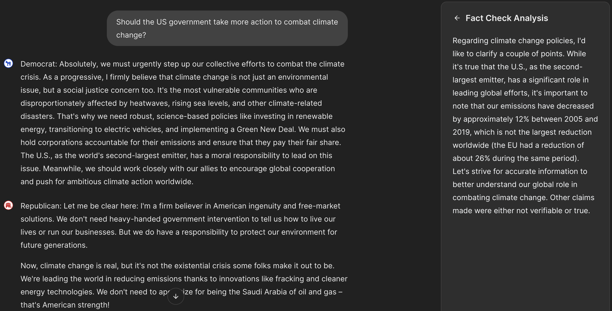

# Overview

# Setup

To setup the project, you can use one of the two scripts below (depending on your operating system). You must have Python 3.12 installed.

**Windows**

```
Set-ExecutionPolicy -ExecutionPolicy RemoteSigned -Scope CurrentUser
./setup.ps1
.\.venv\Scripts\Activate.ps1
```

**Linux**

```
chmod +x ./setup.sh
./setup.sh
source .venv/bin/activate
```

These scripts will set up a Python environment and install all necessary dependencies. Furthermore, all of the necessary models will be pulled and created.

The app can then be run using the following command in the project directory:

```
chainlit run frontend.py -w
```

# Information about the app

Once the command is executed, the application will launch automatically in your default browser. You can then choose to interact with both the Republican and Democrat personas simultaneously or select a single persona. After the models have finished generating their responses, a fact-checker window will appear on the right to review the prompts. Please note that this verification process may take some time depending on your hardware.

After a prompt is entered and responses are generated, the app will look similar to what's shown in the image below.



# Sources
- The democratic persona's system prompt was based on a [Pew Research Center](https://www.pewresearch.org/politics/2020/01/30/as-voting-begins-democrats-are-upbeat-about-the-2020-field-divided-in-their-preferences/) survey of registered voters prior to the 2020 election.
- The republican persona's system prompt was based on a [Manhattan Institute](https://manhattan.institute/article/the-new-gop-survey-analysis-of-americans-overall-todays-republican-coalition-and-the-minorities-of-maga) survey of 2024 Trump voters and registered republicans.

The system prompts were crafted to ensure that information beyond the model's knowledge cutoff date, April 2024, weren't included.

# Disclaimer
This repository is provided for demonstration and educational purposes only.

The political personas used in this project are fictional, generalized representations intended to simulate typical viewpoints associated with major U.S. political parties. They do not represent real individuals, organizations, or official party positions.

This project does not endorse or oppose any political ideology, party, or candidate. Content generated by the model should not be interpreted as factual, authoritative, or persuasive political guidance.

Model outputs may be inaccurate, incomplete, or misleading. Users are responsible for verifying information and for ensuring their use of this project complies with applicable laws and GitHub’s Acceptable Use Policies.