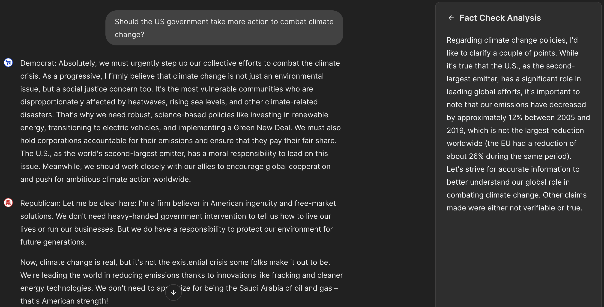

# 🗳️🤖 AI Political Personas

## 🚀 Overview
This project is an interactive AI application that simulates different political personas responding to user queries.

Each persona represents a distinct political perspective and responds according to predefined behavioral guidelines and prompt engineering logic.

The goal is to explore:
- How LLMs can be guided into structured personas
- How bias and framing influence responses
- How AI systems can simulate ideological perspectives responsibly

## 🎯 Motivation
Large Language Models can be steered into specific roles using prompt design.

This project investigates:
- Persona consistency
- Prompt engineering strategies
- Ethical considerations in political AI systems
- User interaction design

## 🛠️ Tech Stack
- Python (3.12)
- LLMs and Model Development & Evaluation
  - Ollama
  - Transformers
  - PyTorch 
  - Foundation model for political and fact-checker personas: [HammerAI/mistral-nemo-uncensored:latest (011ab2c2afa5)](https://ollama.com/HammerAI/mistral-nemo-uncensored)
  - LLM for evaluating political personas: [matous-volf/political-leaning-politics (v2)](https://huggingface.co/matous-volf/political-leaning-politics)
- Chainlit (front-end)
- Plotly Express (data visualization)
- Jupyter Notebook (evaluation of political personas)

The repository was originally developed as a group project for the Generative AI course at the [Vienna University of Technology](https://www.tuwien.at/).

## 🧠 My Contributions
- Designed and implemented the fact-checker persona
- Developed front-end and integration with LLMs.
- Enhancements to the system prompts for the democratic and republican personas.

## ⚙️ How It Works
1. The user selects one or both (default) political personas to prompt.
2. User enters a prompt.
3. Response from the political personas are streamed to the UI.
4. Evaluation from the fact-checker persona is generated then displayed on a sidebar.

## 🖥️ Demo Screenshot



## ▶️ How to Run

### Setup

To set up the project, you can use one of the two scripts below (depending on your operating system). You must have Python 3.12 installed.

**Windows**

```
Set-ExecutionPolicy -ExecutionPolicy RemoteSigned -Scope CurrentUser
./setup.ps1
.\.venv\Scripts\Activate.ps1
```

**Linux**

```
chmod +x ./setup.sh
./setup.sh
source .venv/bin/activate
```

These scripts will set up a Python environment and install all necessary dependencies. Furthermore, all of the necessary models will be pulled and created.

The app can then be run using the following command in the project directory:

```
chainlit run frontend.py -w
```

## ℹ️ Sources
- The democratic persona's system prompt was based on a [Pew Research Center](https://www.pewresearch.org/politics/2020/01/30/as-voting-begins-democrats-are-upbeat-about-the-2020-field-divided-in-their-preferences/) survey of registered voters prior to the 2020 election.
- The republican persona's system prompt was based on a [Manhattan Institute](https://manhattan.institute/article/the-new-gop-survey-analysis-of-americans-overall-todays-republican-coalition-and-the-minorities-of-maga) survey of 2024 Trump voters and registered republicans.

The system prompts were crafted to ensure that information beyond the model's knowledge cutoff date, April 2024, weren't included.

## ⚠️ Disclaimer
This repository is provided for demonstration and educational purposes only.

The political personas used in this project are fictional, generalized representations intended to simulate typical viewpoints associated with major U.S. political parties. They do not represent real individuals, organizations, or official party positions.

This project does not endorse or oppose any political ideology, party, or candidate. Content generated by the model should not be interpreted as factual, authoritative, or persuasive political guidance.

Model outputs may be inaccurate, incomplete, or misleading. Users are responsible for verifying information and for ensuring their use of this project complies with applicable laws and GitHub’s Acceptable Use Policies.
